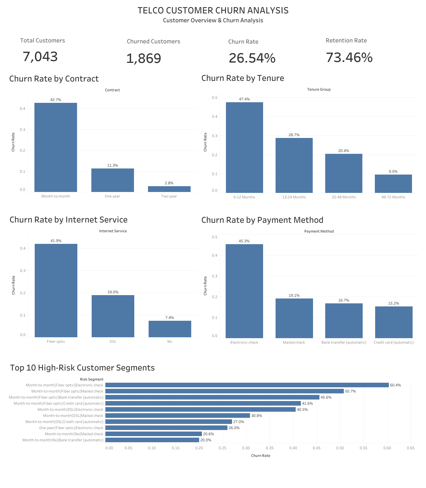

# Telco Customer Churn Analysis

## 📊 Project Overview

This project analyzes customer churn for a telecommunications company using **SQL and Tableau**.

The goal is to identify customer churn patterns, understand the factors associated with customer attrition, and identify high-risk customer segments that can help the business improve customer retention.

The analysis covers customer demographics, contract types, tenure, internet services, payment methods, and other customer attributes.

---

## 🎯 Business Problem

Customer churn is a major challenge for subscription-based businesses.

The objective of this project is to answer questions such as:

* How many customers does the company have?
* What percentage of customers have churned?
* Which contract types have the highest churn?
* Does customer tenure affect churn?
* Which internet service has the highest churn?
* Which payment methods are associated with higher churn?
* Which combinations of customer characteristics represent high-risk segments?

---

## 🛠️ Tools Used

* **SQL** — Data exploration, cleaning, aggregation, and analysis
* **Tableau** — Data visualization and interactive dashboard
* **Excel** — Source dataset
* **GitHub** — Project documentation and portfolio

---

## 📁 Project Structure

```text
telco-customer-churn-analysis/
├── README.md
├── Telco_Customer_Churn_Analysis.twbx
├── churn_analysis.sql
├── TELCO CUSTOMER CHURN ANALYSIS.png
└── Customer_Churn_Analysis.ipynb
└── customer_churn.db
```

---

## 📌 Key KPIs

| KPI               |  Value |
| ----------------- | -----: |
| Total Customers   |  7,043 |
| Churned Customers |  1,869 |
| Churn Rate        | 26.54% |
| Retention Rate    | 73.46% |

---

## 🔍 Key Insights

### 1. Churn by Contract

**Month-to-month contracts have the highest churn rate.**

* Month-to-month: **42.7%**
* One year: **11.3%**
* Two year: **2.8%**

Customers on longer-term contracts are substantially more likely to remain with the company.

### 2. Churn by Tenure

Customers with shorter tenure show significantly higher churn.

The highest churn occurs among customers in their first year, indicating that the early customer lifecycle is a particularly important period for retention efforts.

### 3. Churn by Internet Service

**Fiber optic customers have the highest churn rate.**

* Fiber optic: **41.9%**
* DSL: **19.0%**
* No internet service: **7.4%**

This suggests that fiber-optic customers require further investigation to understand the reasons behind their higher churn.

### 4. Churn by Payment Method

**Electronic check customers have the highest churn rate.**

* Electronic check: **45.3%**
* Mailed check: **19.1%**
* Bank transfer: **16.7%**
* Credit card: **15.2%**

Payment method is therefore an important characteristic when identifying customers at higher risk of churn.

### 5. High-Risk Customer Segments

The analysis combines customer characteristics such as:

* Contract type
* Internet service
* Payment method

This allows high-risk combinations to be identified rather than looking at individual characteristics in isolation.

One of the highest-risk combinations identified is:

**Month-to-month | Fiber optic | Electronic check**

with a churn rate of approximately **60.4%**.

---

## 📈 Tableau Dashboard

The Tableau dashboard provides an executive view of customer churn, including:

* Total customers
* Churned customers
* Overall churn rate
* Retention rate
* Churn rate by contract
* Churn rate by tenure
* Churn rate by internet service
* Churn rate by payment method
* Top 10 high-risk customer segments

### Dashboard Preview



---

## 💡 Business Recommendations

Based on the analysis, the company could focus on the following areas:

1. **Improve early-stage retention**

   * Focus on customers during their first 12 months.
   * Introduce onboarding and early engagement programs.

2. **Encourage longer-term contracts**

   * Provide incentives for customers to move from month-to-month contracts to annual or multi-year plans.

3. **Investigate fiber-optic churn**

   * Analyze pricing, service quality, customer support, and competitive offerings for fiber customers.

4. **Review electronic-check customers**

   * Investigate whether payment experience, billing issues, or customer preferences contribute to higher churn.

5. **Target high-risk segments**

   * Use combinations of contract type, tenure, internet service, and payment method to prioritize retention campaigns.

---

## 🧮 SQL Analysis

SQL was used to:

* Explore the customer dataset
* Calculate customer counts
* Identify churned customers
* Calculate churn rates
* Compare churn across contract types
* Analyze churn by tenure groups
* Analyze churn by internet service
* Analyze churn by payment method
* Identify high-risk customer segments

The complete SQL analysis is available in:

`churn_analysis.sql`

---

## 📊 Tableau Workbook

The completed Tableau workbook is available in:

`Telco_Customer_Churn_Analysis.twbx`

The workbook contains the individual analysis sheets and the final customer churn dashboard.

---

## 📚 Conclusion

The analysis shows that customer churn is strongly associated with several customer characteristics, particularly **contract type, tenure, internet service, and payment method**.

Month-to-month customers, newer customers, fiber-optic customers, and electronic-check users represent important groups for further investigation.

By combining SQL-based analysis with Tableau visualization, this project transforms raw customer data into actionable business insights that can support targeted customer retention strategies.

---

## 👤 Author

**Telco Customer Churn Analysis**

Built using **SQL + Tableau** as a data analytics portfolio project.
